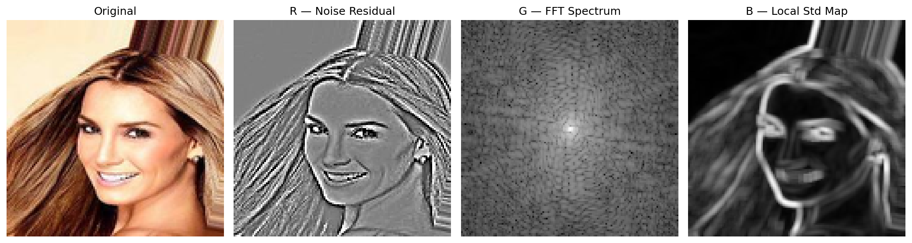
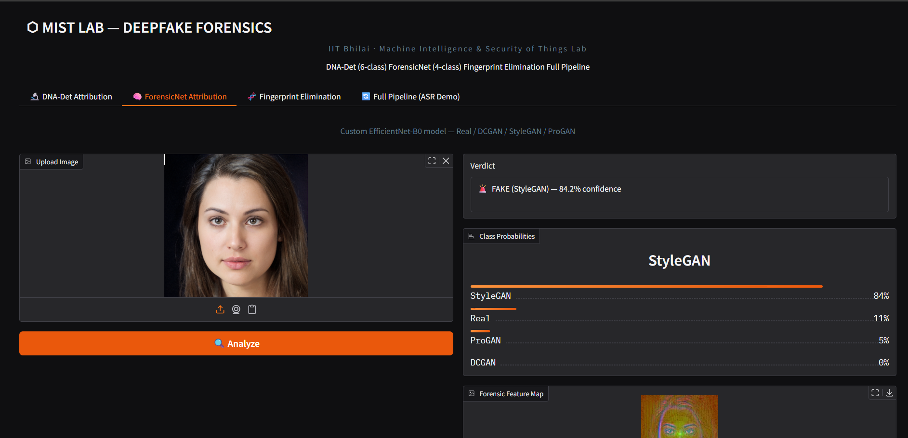
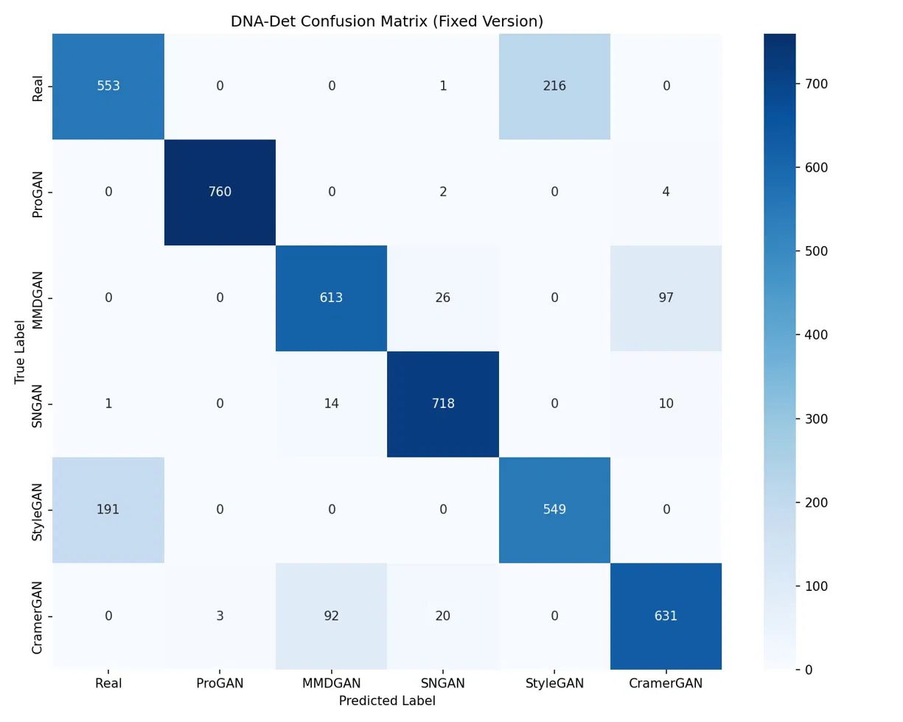
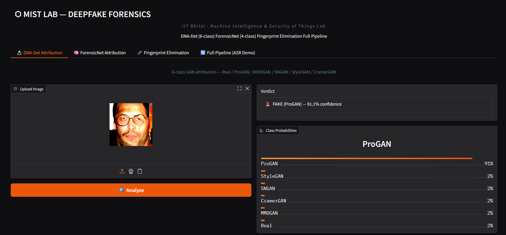
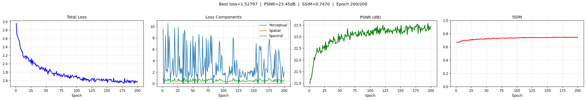
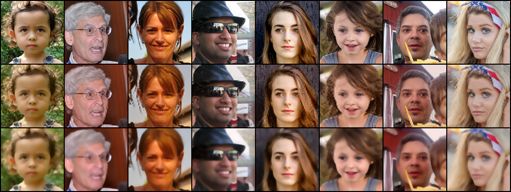
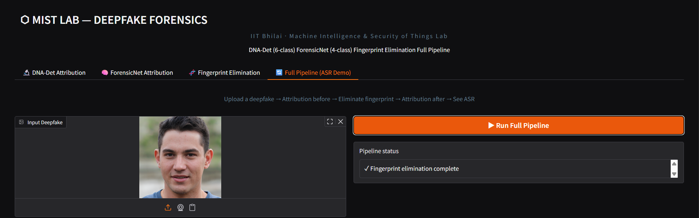
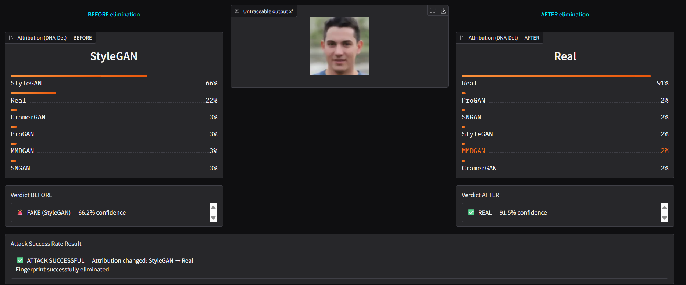

# GAN Fingerprint Elimination & Deepfake Attribution

> **Research Internship Project** — IIT Bhilai, MIST Lab (Jan–Jun 2026)
> Supervisor: Dr. Sk. Subidh Ali
> Based on: *Lai et al., "Untraceable DeepFakes via Traceable Fingerprint Elimination", AAAI 2026*
> Paper: https://arxiv.org/abs/2412.09373

---

## Overview

This project implements two systems:

1. **GAN Fingerprint Elimination** — removes GAN-specific forensic traces from deepfake images so they cannot be attributed to their source GAN, while preserving perceptual quality. Evaluated against DNA-Det.

2. **ForensicNet** — a custom-designed 4-class deepfake attribution model (original contribution) built on EfficientNet-B0 with a novel 3-channel forensic feature extractor. No reference implementation was used.

Both systems are combined in a single **Gradio UI** (`app.py`) with 4 interactive tabs.

---

## Repository Structure

```
gan-fingerprint-elimination/
│
├── app.py                          ← Combined Gradio UI (4 tabs)
├── annotation_new.py               ← Step 1 — Dataset annotation for DNA-Det
├── train_dna-det.py                ← Step 2 — DNA-Det 6-class training
├── testing_dna-det_attribution.py  ← Step 3 — DNA-Det inference UI
├── final_elimination.py            ← Step 4 — Fingerprint elimination training
│
├── custom_attribution/             ← ForensicNet (original custom model)
│   ├── step1_dataset_builder.py    ← Builds 4-class dataset (dataset_v5/)
│   ├── forensicnet.py              ← Model definition + forensic extractor
│   ├── train.py                    ← Two-phase EfficientNet-B0 training
│   └── inference.py                ← Single image prediction CLI
│
├── generation_scripts/             ← Scripts used to generate GAN images
│   ├── stylegan2_generate.py       ← StyleGAN2-ADA (FFHQ weights, 1024×1024)
│   ├── dcgan_generation.py         ← DCGAN v1 (64px, latent=128)
│   ├── dcgan_archA.py              ← DCGAN v2 / ArchA (128px, latent=100, 2-phase)
│   ├── progan_tfhub_5000images.py  ← ProGAN via TF Hub
│   └── progan_tfhub_generate.py    ← ProGAN generation script
│
├── samples/                        ← Demo images and result visualizations
│   ├── forensicnet.png             ← ForensicNet forensic feature map
│   ├── confusion_matrix.webp       ← DNA-Det confusion matrix
│   ├── gradioui_dna-det.png        ← DNA-Det Gradio UI
│   ├── gradioui_forensicnet.png    ← ForensicNet Gradio UI
│   ├── training_curves.png         ← Elimination model training curves
│   ├── viz_ep200.png               ← Epoch 200 output visualization
│   ├── final_UI.png                ← Combined UI screenshot Tab 1
│   └── final_UI2.png               ← Combined UI screenshot Tab 2
│
├── checkpoints/                    ← Model weights (not tracked — see below)
├── requirements.txt
├── .gitignore
└── README.md
```

---

## Installation

```bash
git clone https://github.com/<your-username>/gan-fingerprint-elimination.git
cd gan-fingerprint-elimination
pip install -r requirements.txt
```

**Requirements:** Python 3.8+ · CUDA-enabled GPU recommended for training

---

## How to Run — Step by Step

### Part 1 — ForensicNet (Custom 4-Class Attribution)

**Step 1 — Generate GAN images into raw_inputs/**
```bash
# StyleGAN images
python generation_scripts/stylegan2_generate.py \
    --output_dir ./raw_inputs/StyleGAN

# ProGAN images
python generation_scripts/progan_tfhub_5000images.py \
    --output_dir ./raw_inputs/ProGAN

# DCGAN images (run both)
python generation_scripts/dcgan_generation.py \
    --data_dir ./raw_inputs/celeba --output_dir ./raw_inputs/DCGAN

python generation_scripts/dcgan_archA.py \
    --data_dir ./raw_inputs/celeba --output_dir ./raw_inputs/DCGAN --phase 1
python generation_scripts/dcgan_archA.py \
    --data_dir ./raw_inputs/celeba --output_dir ./raw_inputs/DCGAN --phase 2

# Place real images manually
# raw_inputs/Real/ ← FFHQ or CelebA images
```

**Step 2 — Build dataset**
```bash
python custom_attribution/step1_dataset_builder.py
# Output: dataset_v5/ with 5,000 images per class (20,000 total)
```

**Step 3 — Train ForensicNet**
```bash
python custom_attribution/train.py \
    --data_dir ./dataset_v5 \
    --ckpt_path ./checkpoints/forensicnet_best.pth
# Phase 1: 5 epochs head warmup
# Phase 2: 25 epochs full fine-tune
# Best checkpoint saved automatically
```

**Step 4 — Test single image**
```bash
python custom_attribution/inference.py \
    --image ./samples/any_face.jpg \
    --ckpt ./checkpoints/forensicnet_best.pth
# Prints: prediction, confidence, per-class probability bar chart
```




---

### Part 2 — DNA-Det (6-Class Attribution)

**Step 1 — Edit paths in annotation_new.py**
```python
# Open annotation_new.py and set your local paths:
CLASS_DIR_MAP = {
    "Real"      : ["/path/to/real_images"],
    "ProGAN"    : ["/path/to/progan_images"],
    ...
}
ANN_DIR    = "./annotations"
RESIZED_DIR = "./resized_128"
```

**Step 2 — Generate annotation files**
```bash
python annotation_new.py
# Output: annotations/train.txt, val.txt, test.txt
# Also resizes all images to 128x128 in RESIZED_DIR
```

**Step 3 — Edit paths in train_dna-det.py**
```python
ANN_DIR  = "./annotations"
SAVE_DIR = "./checkpoints"
```

**Step 4 — Train DNA-Det**
```bash
python train_dna-det.py
# Trains for 60 epochs
# Saves best model based on min per-class accuracy
# Per-class accuracy logged every epoch
```

**Step 5 — Run DNA-Det inference UI**
```bash
# Edit SAVE_DIR in testing_dna-det_attribution.py first
python testing_dna-det_attribution.py
# Opens Gradio UI at http://localhost:7862
# Upload any image → get GAN source prediction
```




---

### Part 3 — Fingerprint Elimination

**Step 1 — Edit paths in final_elimination.py**
```python
CONFIG = {
    "image_folder"   : "/path/to/ffhq/thumbnails128x128",
    "checkpoint_dir" : "./checkpoints_fixed_v1",
    "output_dir"     : "./outputs_fixed_v1",
}
```

**Step 2 — Train elimination model**
```bash
python final_elimination.py
# Trains on FFHQ 128x128 (70,000 images)
# Recommended: NVIDIA A6000 or equivalent (48GB VRAM)
# Saves checkpoints every N epochs to checkpoint_dir
```

**Step 3 — Monitor training**
```
# Training prints per-epoch:
# Loss: attribution + perceptual + spectral + spatial
# PSNR and SSIM on validation batch
# ASR against DNA-Det on test GAN images
```




---

### Part 4 — Combined Gradio UI (All-in-One)

**Step 1 — Place all three checkpoints**
```
checkpoints/
├── dnadet_best.pth           ← from train_dna-det.py
├── forensicnet_best.pth      ← from custom_attribution/train.py
└── elimination_best.pth      ← from final_elimination.py
```

**Step 2 — Edit checkpoint paths in app.py**
```python
DNA_DET_CKPT     = "./checkpoints/dnadet_best.pth"
FORENSICNET_CKPT = "./checkpoints/forensicnet_best.pth"
ELIMINATION_CKPT = "./checkpoints/elimination_best.pth"
```

**Step 3 — Run**
```bash
python app.py
# Opens at http://localhost:7860
# A public shareable link is also printed (share=True)
```

What It Does 
 DNA-Det Attribution | Upload image → 6-class GAN source prediction + forensic feature map 
 ForensicNet Attribution | Upload image → 4-class custom model prediction 
 Fingerprint Elimination | Upload deepfake → remove fingerprint → download clean image 
 Full Pipeline (ASR Demo) | Attribution → Eliminate → Attribution again → see if attack succeeded 




---

## Part 1 — ForensicNet Details

> Independent original contribution. No reference implementation used.

A 4-class deepfake attribution model classifying images as:
**Real / ProGAN / StyleGAN / DCGAN**

Uses EfficientNet-B0 as backbone with a custom 3-channel forensic feature extractor instead of raw RGB:

| Channel | Feature | What It Captures |
|---|---|---|
| R | Gaussian Residual Map | High-frequency noise fingerprints |
| G | FFT Magnitude Spectrum | Frequency-domain GAN artifacts |
| B | Local Noise Std Map | Spatial texture variance |

**Training:** Two-phase — 5 epochs head warmup (lr=1e-3) then 25 epochs full fine-tune (lr=5e-6) with CosineAnnealingLR and label smoothing=0.05.

---

## Part 2 — DNA-Det Details

Trains a custom ResNet-style attribution model as the **target** for fingerprint elimination. The elimination model is trained to fool DNA-Det into misclassifying GAN images as Real or a different GAN class.

**Dataset Sources (6-class):**

| Class | Source |
|---|---|
| Real | FFHQ: https://github.com/NVlabs/ffhq-dataset |
| ProGAN | https://github.com/tkarras/progressive_growing_of_gans |
| StyleGAN | https://github.com/NVlabs/stylegan2-ada-pytorch |
| SNGAN | https://github.com/pfnet-research/sngan_projection |
| CramerGAN | https://github.com/StanleyFu/cramer-gan |
| MMDGAN | https://github.com/OctoberChang/MMD-GAN |

---

## Part 3 — Fingerprint Elimination Details

### Architecture

```
Input image x
    → Encoder (Conv + 5 ResidualBlocks)
    → Decoder (Upsample + Conv)
    → Residual output δ
    → x' = clamp(x + δ, -1, 1)
    → GBMS Smoother (Gaussian Blur + Mean Shift)
    → Final untraceable image x'
```

### Loss Functions

| Loss | Purpose |
|---|---|
| Attribution Loss (β1) | Fool DNA-Det (cross-entropy) |
| Perceptual Loss (β2) | Preserve visual quality (VGG16) |
| Spectral Loss (β3) | Preserve frequency content (FFT) |
| Spatial Loss | Pixel-level similarity (L1) |

### Key Bug Fixes Applied

| Fix | Issue | Solution |
|---|---|---|
| FIX 1 | float16 overflow in VGG under AMP | Cast pred/target to float32 before VGG forward |
| FIX 2 | GAN-specific transforms causing overfitting | Removed; kept only paper's 6 transforms |
| FIX 3 | Bilinear JPEG proxy inaccurate | Real PIL JPEG encode/decode via BytesIO |
| FIX 4 | Decoder weight init saturation (33.6%) | Xavier uniform gain=0.1 + zero bias |
| FIX 5 | ProGAN nearest-neighbour coverage | Sampling bias: nearest=0.5, bilinear=0.3, bicubic=0.2 |
| FIX 6 | Stale GradScaler from broken run | Reset init_scale=2¹⁰ |

---

## Results

### Fingerprint Elimination — ASR against DNA-Det

| GAN | ASR (↑) | Images Tested |
|---|---|---|
| MMDGAN | 100.0% | 300 |
| CramerGAN | 99.3% | 300 |
| SNGAN | 53.7% | 300 |
| StyleGAN | 43.3% | 300 |
| **Overall** | **74.1%** | **1,200** |

**Image Quality:** PSNR 23.57 dB · SSIM 0.751
> **Note:** ProGAN results are reported separately in the Limitations
> section due to a known hard fingerprint issue. See Limitations for
> full technical analysis.
---

## Limitations

### ProGAN — Hard Fingerprint Problem

The elimination model achieves ~1% ASR on ProGAN compared to 99–100% on MMDGAN and CramerGAN. Two root causes were identified:

**1. Sampling bias insufficient:**
ProGAN uses nearest-neighbour upsampling which creates checkerboard artifacts at specific spatial frequencies. The nearest-neighbour sampling unit was not firing frequently enough (~16.5% of steps) to expose the model to these patterns. Even after Fix 5 (increased to ~35%), coverage remained insufficient for full fingerprint removal.

**2. Spectral loss blind spot:**
ProGAN checkerboard artifacts concentrate at FFT corner frequencies (Nyquist region). SpectralLoss computes global FFT magnitude difference but does not apply targeted weighting to these corner regions, so the elimination model never receives a strong gradient signal to remove ProGAN-specific spectral patterns.

### Other Known Limitations

- Model trained on FFHQ 128×128 only — may not generalise to other resolutions or non-face domains
- PSNR 23.57 dB is below broadcast-quality threshold (>30 dB) — visible smoothing artifacts present in some outputs
- Single shared model for all GAN classes — no architecture-specific specialisation

---

## Future Scope

**1. Architecture-specific training for hard fingerprints**
Train separate elimination heads per GAN architecture, or use a mixture-of-experts approach where a routing network selects the appropriate elimination path based on detected fingerprint type. Expected to resolve ProGAN's ~1% ASR.

**2. Targeted spectral loss at corner frequencies**
Modify SpectralLoss to apply higher weighting at FFT corner regions (spatial frequencies above 0.8× Nyquist) where ProGAN and similar nearest-neighbour upsampling artifacts concentrate.

**3. Higher resolution support**
Extend the framework to 256×256 and 512×512 by scaling the encoder-decoder with additional residual blocks and progressive training.

**4. Generalisation beyond faces**
Current training data (FFHQ) is face-only. Re-training on diverse image domains (LSUN, ImageNet subsets) would test generalisation of the fingerprint elimination approach.

**5. Extend ForensicNet to more GAN classes**
Currently 4-class (Real/ProGAN/StyleGAN/DCGAN). Extending to include MMDGAN, SNGAN, CramerGAN, and newer architectures (StyleGAN3, Stable Diffusion) would make it a more comprehensive attribution tool.

**6. Real-time inference optimisation**
Current elimination pipeline runs at ~0.3s per image on A6000. Distillation or pruning of the encoder-decoder could enable real-time use on consumer hardware.

---

## Model Weights

Trained checkpoints are not included in this repository due to size.
Available on request — contact:

- **Supervisor:** Dr. Sk. Subidh Ali, IIT Bhilai
- **Author:** Shubhangi Pandey — shubhangi.dgn@gmail.com

---

## References & Citations

**Primary Paper (implemented):**
```bibtex
@inproceedings{lai2026untraceable,
  title     = {Untraceable DeepFakes via Traceable Fingerprint Elimination},
  author    = {Lai, et al.},
  booktitle = {AAAI},
  year      = {2026},
  url       = {https://arxiv.org/abs/2412.09373}
}
```

**DNA-Det (target attribution model):**
```bibtex
@inproceedings{yang2022deepfake,
  title     = {DeepFake Network Architecture Attribution},
  author    = {Yang, Tianyun and Huang, Ziyao and Du, Le and Li, Jun and Tan, Chunyuan},
  booktitle = {AAAI},
  year      = {2022}
}
```

**TraceEvader:**
```bibtex
@inproceedings{wu2024traceevader,
  title     = {TraceEvader: Making DeepFakes More Untraceable},
  author    = {Wu, et al.},
  booktitle = {AAAI},
  year      = {2024}
}
```

**GAN Architectures:**
```bibtex
@inproceedings{karras2019stylegan,
  title     = {A Style-Based Generator Architecture for Generative Adversarial Networks},
  author    = {Karras, Tero and Laine, Samuli and Aila, Timo},
  booktitle = {CVPR},
  year      = {2019},
  url       = {https://github.com/NVlabs/stylegan2-ada-pytorch}
}

@inproceedings{karras2018progan,
  title     = {Progressive Growing of GANs for Improved Quality, Stability, and Variation},
  author    = {Karras, Tero and Aila, Timo and Laine, Samuli and Lehtinen, Jaakko},
  booktitle = {ICLR},
  year      = {2018},
  url       = {https://github.com/tkarras/progressive_growing_of_gans}
}

@inproceedings{goodfellow2014gan,
  title     = {Generative Adversarial Nets},
  author    = {Goodfellow, Ian and Pouget-Abadie, Jean and Mirza, Mehdi and Xu, Bing and Warde-Farley, David and Ozair, Sherjil and Courville, Aaron and Bengio, Yoshua},
  booktitle = {NeurIPS},
  year      = {2014}
}
```

**Backbone (ForensicNet):**
```bibtex
@inproceedings{tan2019efficientnet,
  title     = {EfficientNet: Rethinking Model Scaling for Convolutional Neural Networks},
  author    = {Tan, Mingxing and Le, Quoc V.},
  booktitle = {ICML},
  year      = {2019}
}
```

**Datasets & Resources:**
- FFHQ Dataset (NVIDIA): https://github.com/NVlabs/ffhq-dataset
- DNA-Det Official Repository: https://github.com/PaddlePaddle/PaddleGAN
- 140k Real and Fake Faces: https://www.kaggle.com/datasets/xhlulu/140k-real-and-fake-faces
## License
Licensed under [CC BY-NC 4.0](https://creativecommons.org/licenses/by-nc/4.0/)
© 2026 Shubhangi Pandey, MIST Lab, IIT Bhilai
For academic and research use only.

---

*MIST Lab · IIT Bhilai · Internship Project · Jan–Jun 2026*
